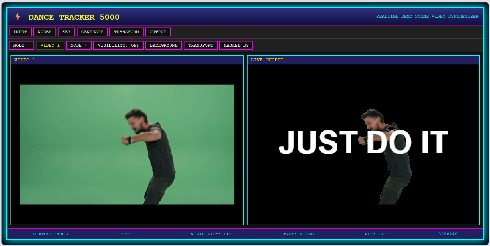
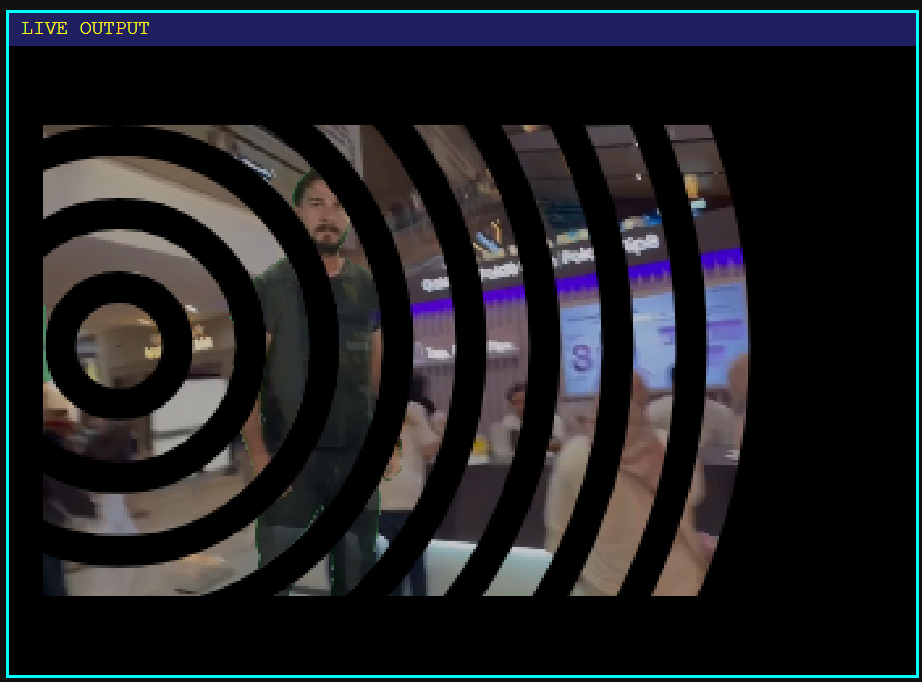
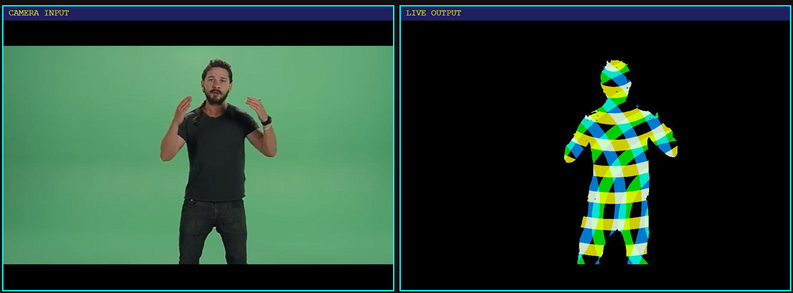
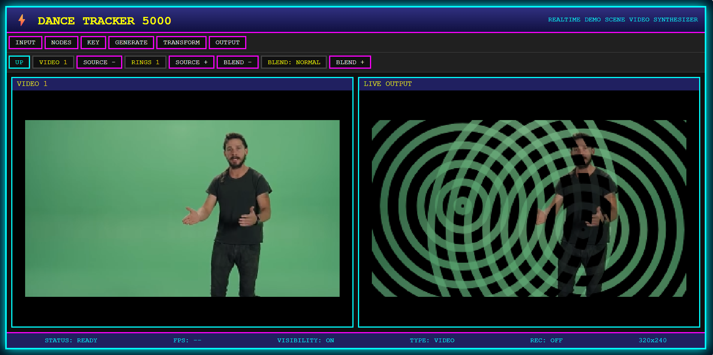

# DANCE TRACKER 5000
## Powered by Copper Engine

A realtime visual instrument from an alternate 1990s future.

DANCE TRACKER 5000 is one of the first Rust/WASM-powered visual effects compositor inspired by the legendary Amiga demo scene. It combines the spirit of tracker software, realtime graphics experiments, and modern node-based processing into a unique creative environment.

Behind its deliberately retro interface runs **Copper Engine** — a state-of-the-art visual processing architecture built around operations, nodes, and realtime execution pipelines.

The result is a tool that feels like it escaped from an Amiga 500 demo disk and landed in the modern web.

## Features

- Realtime video processing
- Rust/WASM performance
- Node-based internal compositor architecture
- Procedural visual generation
- Keying and matte operations
- Transform and effect pipelines
- Retro-inspired creative workflow

## Visual Language

Instead of overwhelming users with hundreds of technical controls, DANCE TRACKER 5000 organizes visual operations into creative categories:

### ASTRA
Generate motion, space, and procedural worlds.

Stars, particles, rings, plasma, tunnels, and other demo-inspired effects.

### SPECTRA
Manipulate light and visual energy.

Colour, brightness, contrast, glow, distortion, and signal effects.

### CHROMA
Create and control visual materials.

Mattes, masks, clouds, gradients, noise, and compositing elements.

### KINETIC
Control movement and transformation.

Position, rotation, scaling, warping, animation, and time-based effects.

## Built for the Demo Scene Generation

DANCE TRACKER 5000 takes inspiration from an era when programmers pushed limited hardware to impossible places. The goal is not to recreate the past, but to continue the same philosophy:

**Realtime creativity. Minimal barriers. Maximum expression.**

A modern visual synthesizer wearing the interface of a forgotten 1990s computer.

---

## Technology

- Rust core
- WebAssembly runtime
- Graph-based execution engine
- Modular visual operators
- Browser-native realtime rendering

Powered by **Copper Engine**.
Built for the future. Designed like the past.

## Screenshots

v0.1

